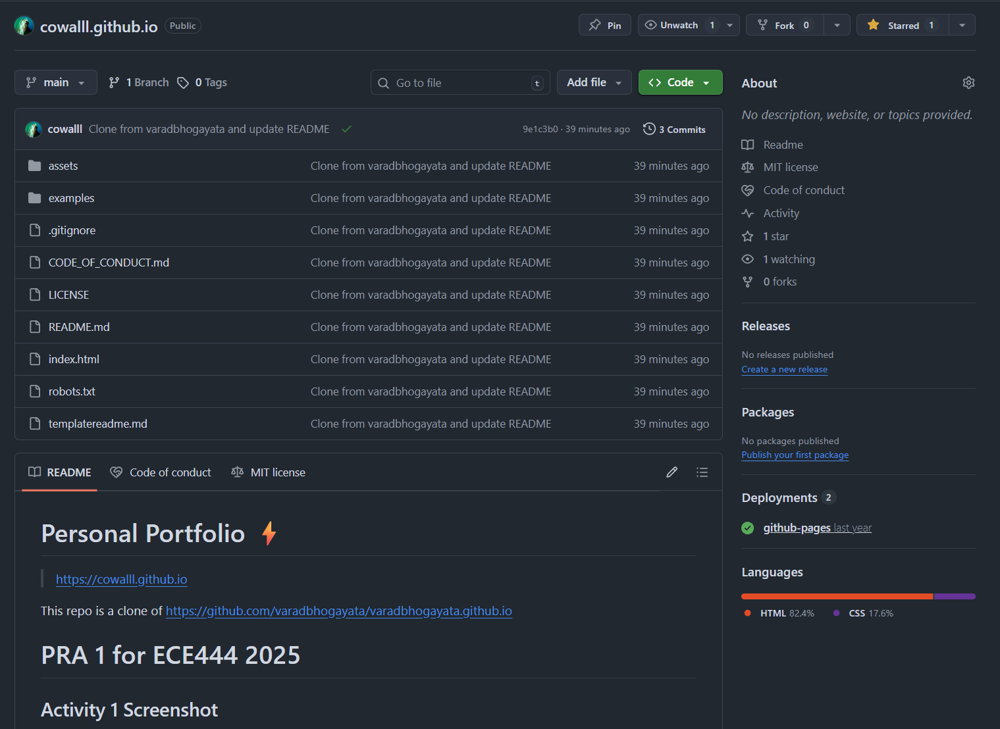
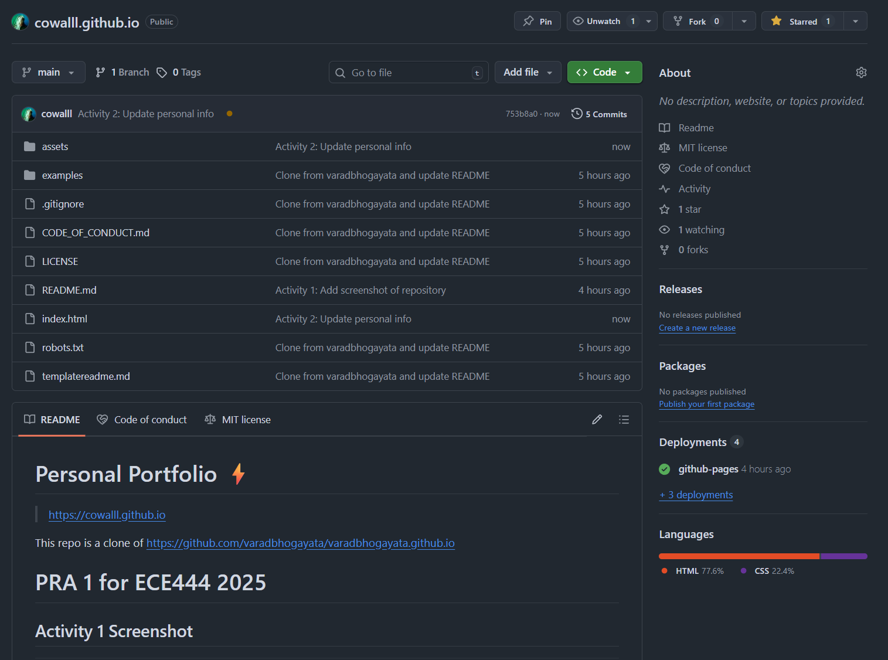
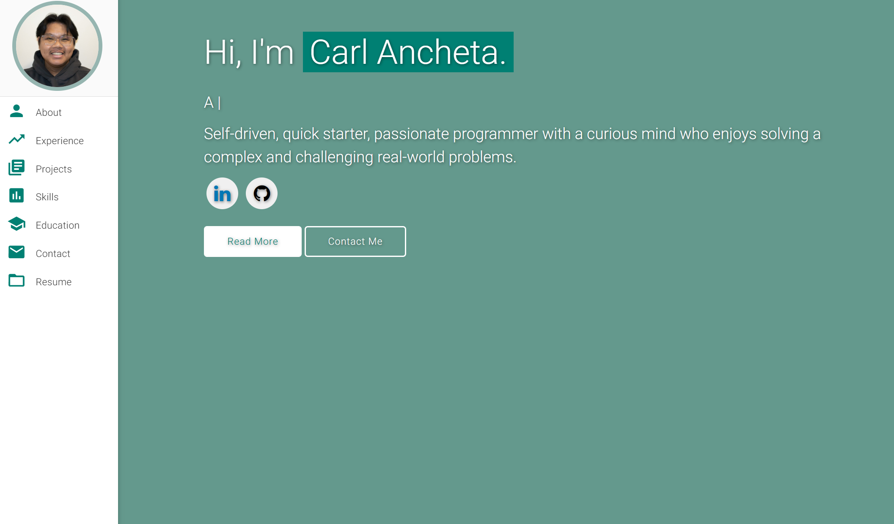
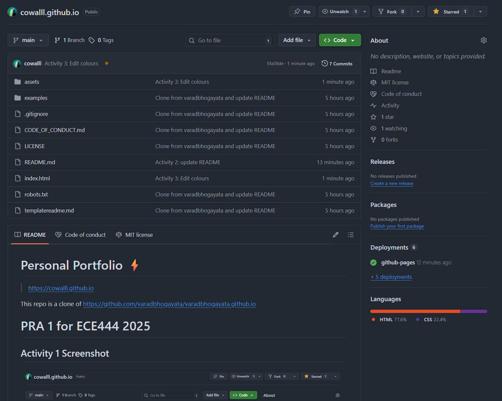
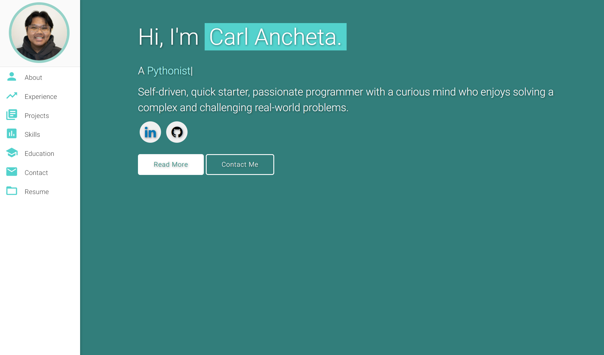
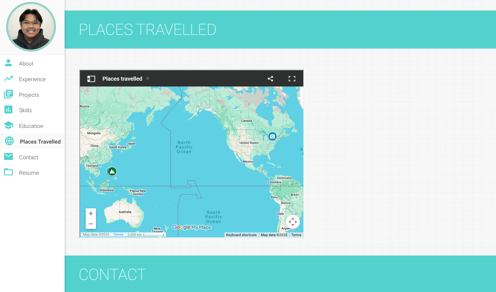
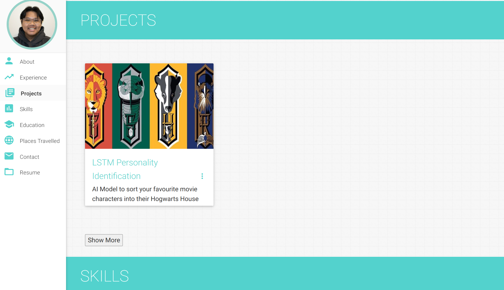
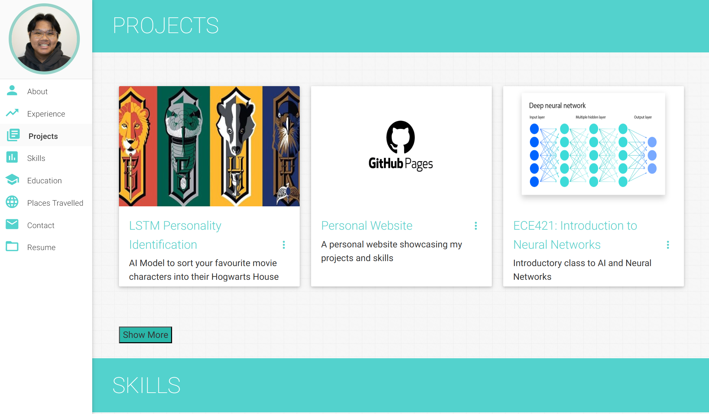

# Personal Portfolio ⚡️ 

> https://cowalll.github.io

This repo is a clone of https://github.com/varadbhogayata/varadbhogayata.github.io

# PRA 1 for ECE444 2025

## Activity 1 Screenshot

## Activity 2 Screenshots

## Activity 3 Screenshots

## Activity 4 Screenshots

## Activity 5 Screenshots

### Website Preview

 
  <kbd>
    
  </kbd>

## License 📄
This project is licensed under the MIT License - see the [LICENSE.md](./LICENSE) file for details.
